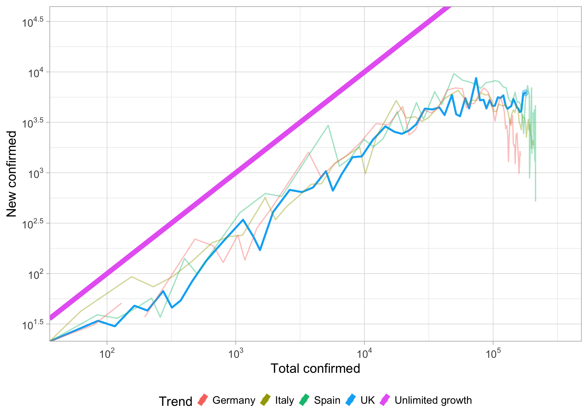

# Covid19predict
 
## Current UK trend

Data Sources: 
- [JHU CSSE Data Repository](https://github.com/CSSEGISandData/COVID-19)
- [中华人民共和国国家卫生健康委员会](http://www.nhc.gov.cn/xcs/yqtb/list_gzbd.shtml)
- [UK API](https://github.com/isjeffcom/coronvirusFigureUK) by Jeff
