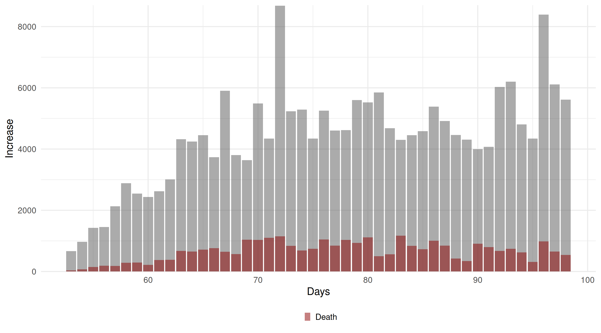
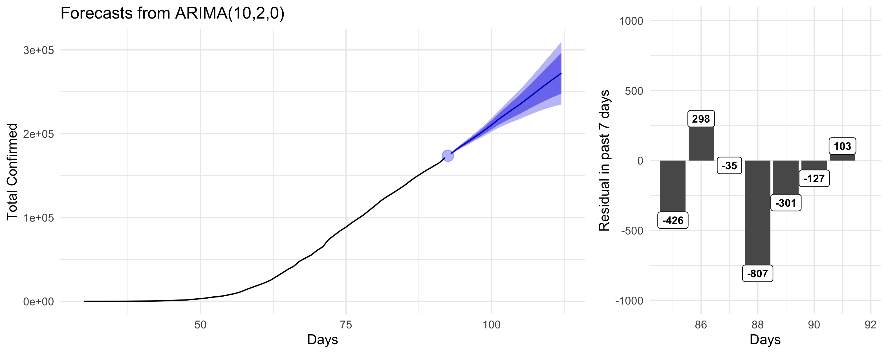
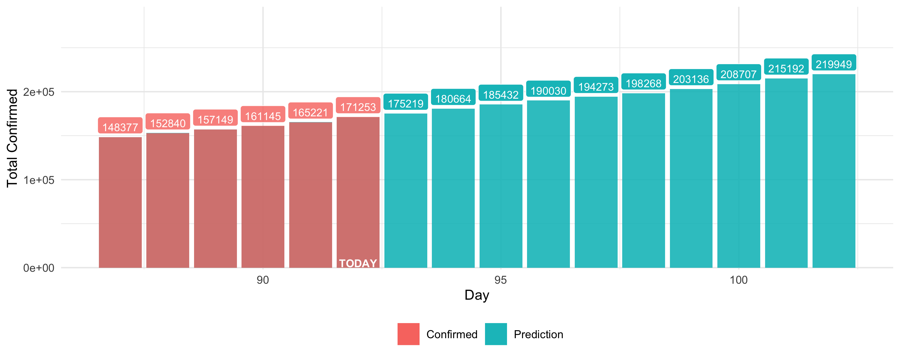
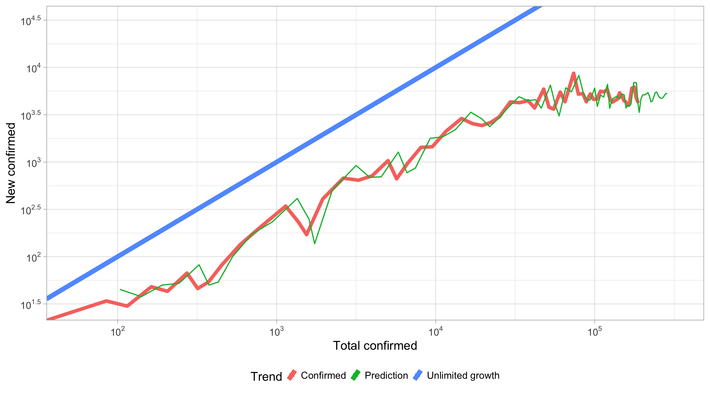
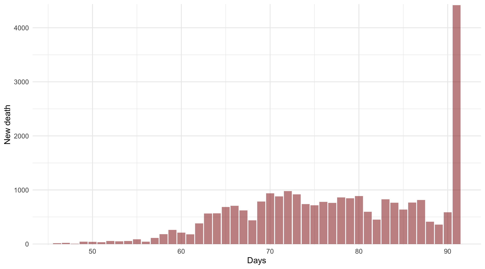

 

# Cases

| Confirmed| Death| Cured| Serious| England| Scotland| Wales| N.Ireland|
|---------:|-----:|-----:|-------:|-------:|--------:|-----:|----------------:|
|    148377| 20319|     0|       0|  108051|    10051|  8900|             3226|

# ARIMA Prediction

## Log trend and elbow point

Compare trend with success case (🇨🇳, 🇰🇷) and EU countries:

- [Log trend comparison](./trendFigures.html)

More about axis and interpretation of Log trend: 

- [How To Tell If We're Beating COVID-19](https://youtu.be/54XLXg4fYsc)

# Current

## New death 

## UK and EU Log trend

Data Sources: 
- [JHU CSSE Data Repository](https://github.com/CSSEGISandData/COVID-19)
- [中华人民共和国国家卫生健康委员会](http://www.nhc.gov.cn/xcs/yqtb/list_gzbd.shtml)
- [UK API](https://github.com/isjeffcom/coronvirusFigureUK) by Jeff
