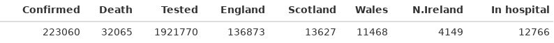
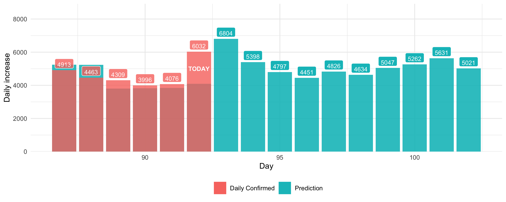

 

# Cases

# ARIMA Prediction
## Total confirmed

## Daily increase

## Log trend and elbow point

## [Log trend comparison](./trendFigures.html)
- Compare trend with success case (🇨🇳, 🇰🇷) and EU countries

More about axis and interpretation of Log trend: 

- [How To Tell If We're Beating COVID-19](https://youtu.be/54XLXg4fYsc)

# Current
## New cases

## New death

Notes on 29 April increase:
- [UK deaths pass 26,000 as figures include care home cases](https://www.bbc.co.uk/news/uk-52478085)
## UK and EU Log trend

Data Sources: 
- [JHU CSSE Data Repository](https://github.com/CSSEGISandData/COVID-19)
- [中华人民共和国国家卫生健康委员会](http://www.nhc.gov.cn/xcs/yqtb/list_gzbd.shtml)
- [UK API](https://github.com/isjeffcom/coronvirusFigureUK) by Jeff
